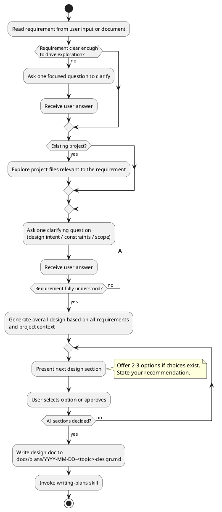

# Brainstorming Ideas Into Designs

## Overview

Help turn ideas into fully formed designs through structured collaborative dialogue.

Read the requirement first, explore only the relevant parts of the codebase, ask questions until the requirement is fully understood, then generate a design and let the user make decisions section by section.

<HARD-GATE>
Do NOT explore the codebase before reading the requirement.
Do NOT generate a design until all clarifying questions are resolved.
Do NOT write any code or invoke any implementation action during this process.
</HARD-GATE>

## Anti-Pattern: "Explore First, Ask Later"

Loading all files and docs before understanding the requirement wastes context and loses focus. Codebase exploration must be driven by the requirement — not the other way around.

## Checklist

You MUST create a task for each item and complete them in order:

1. **Read requirement** — read what the user provided (natural language, doc, issue, user story). Do not proceed without a clear requirement.
2. **Targeted exploration** — based on the requirement, read only the relevant files, interfaces, and entry points in the project.
3. **Clarifying questions** — ask one question at a time about unclear aspects (design intent, constraints, scope). Loop until you are confident you fully understand the requirement.
4. **Generate design** — based on all collected requirements and project context, produce the overall design.
5. **Present design by section** — split the design by complexity; for each section present 2-3 options where choices exist and let the user decide.
6. **Write design doc** — after all sections are decided, save to `docs/plans/YYYY-MM-DD-<topic>-design.md`.
7. **Hand off to implementation** — invoke writing-plans skill.

## Process Flow

## Step Details

**Step 1 — Read requirement:**
- Accept natural language description, PRD, GitHub issue, or user story
- If the input is too vague to drive exploration, ask one focused question before proceeding

**Step 2 — Targeted exploration:**
- Identify which modules, files, and interfaces are relevant to the requirement
- Read only those; do NOT scan the entire codebase
- If greenfield (no existing project), skip this step

**Step 3 — Clarifying questions:**
- One question per message
- Focus on: design intent, constraints, edge cases, success criteria
- Prefer multiple-choice questions where possible
- Continue looping until you have no remaining unknowns

**Step 4 — Generate design:**
- Synthesize all requirements and project context into a coherent design
- Apply YAGNI: remove anything not required by the stated need

**Step 5 — Present design by section:**
- Divide the design into sections sized by complexity
- For each section: describe the approach, then offer 2-3 concrete options if a design decision exists
- State your recommendation and reasoning for each option
- Wait for the user to decide before moving to the next section
- Cover: architecture, components, data flow, error handling, testing

**Step 6 — Write design doc:**
- Save the finalized design to `docs/plans/YYYY-MM-DD-<topic>-design.md`
- Use elements-of-style:writing-clearly-and-concisely skill if available

**Step 7 — Hand off to implementation:**
- Invoke writing-plans skill — this is the only skill invoked after brainstorming

## Key Principles

- **Requirement first** — never explore before reading the requirement
- **Targeted exploration** — read only what the requirement points to
- **One question at a time** — do not bundle multiple questions
- **Loop until clear** — keep asking until there are no remaining unknowns
- **YAGNI** — remove anything not required by the stated need
- **Options per section** — give the user real choices, not a rubber stamp
